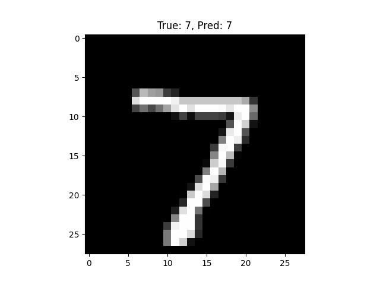

# MNIST Digit Classifier (PyTorch)

An end-to-end handwritten digit recognition project built with PyTorch.

## Highlights

- Fully connected neural network for MNIST (`0-9` classification)
- Training + evaluation pipeline
- Saved model checkpoint for reuse
- Live drawing canvas prediction with OpenCV
- GPU/CPU auto device selection

## Tech Stack

- Python
- PyTorch + Torchvision
- NumPy
- OpenCV
- Matplotlib

## Project Structure

```text
MNIST/
  src/
    config.py          # Hyperparameters and device config
    data_loader.py     # MNIST download + dataloaders
    model.py           # SimpleNN architecture
    train.py           # Training + evaluation + save outputs
  data/                # Downloaded MNIST dataset
  models/
    mnist_model.pth    # Trained model weights
  results/
    first_prediction.png
  predict_draw.py      # Live draw-and-predict app
  README.md
```

## Model Architecture

`SimpleNN` from `src/model.py`:

- Input: `28x28` grayscale image flattened to `784`
- Hidden Layer 1: `784 -> 128` + BatchNorm + ReLU + Dropout
- Hidden Layer 2: `128 -> 64` + BatchNorm + ReLU + Dropout
- Output Layer: `64 -> 10` logits

## Setup

1. Clone the repository
2. Create and activate a virtual environment
3. Install dependencies

```bash
pip install torch torchvision numpy opencv-python matplotlib
```

## Training

Run from project root:

```bash
python -m src.train
```

This will:

- Download MNIST (if not already present) into `data/`
- Train for configured epochs
- Evaluate on test set
- Save model to `models/mnist_model.pth`
- Save sample prediction image to `results/first_prediction.png`

## Live Prediction (Draw Your Own Digit)

After training:

```bash
python predict_draw.py
```

Controls:

- Hold left mouse button to draw
- `c` to clear
- `q` to quit

## Configuration

You can tune settings in `src/config.py`:

- Data: batch size, shuffle, workers
- Training: learning rate, epochs, weight decay
- Model: hidden sizes, dropout rate

Current defaults:

- Epochs: `40`
- Batch size: `64`
- Learning rate: `0.005`

## Results

Training prints final test accuracy in terminal.  
Example output image generated by training:



## Future Improvements

- Replace `SimpleNN` with a CNN for higher accuracy
- Add data augmentation for better generalization
- Add confusion matrix and per-class metrics
- Export model to ONNX/TorchScript
- Build REST API (FastAPI) and web UI deployment
- Add Docker + CI workflow for reproducible training
