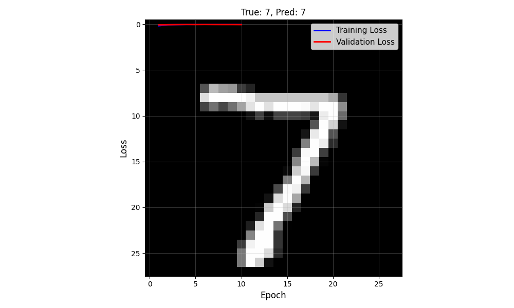
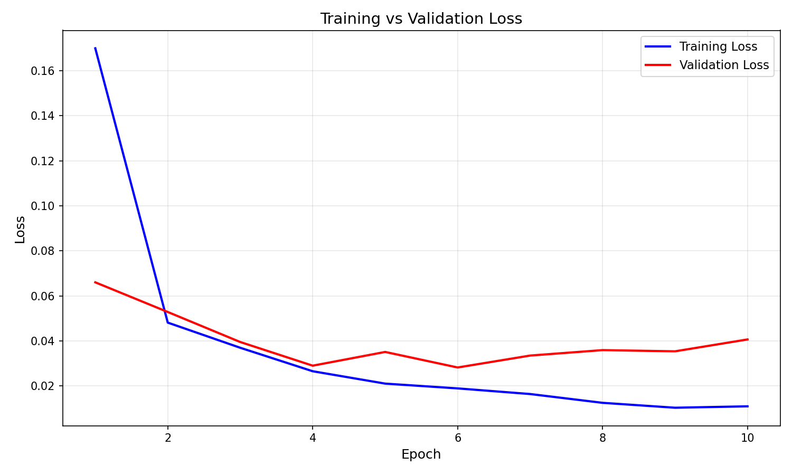

# MNIST Inference Service

Production-ready handwritten digit classification service built with PyTorch, ONNX Runtime, and FastAPI.

## Architecture

```
Image (28x28)
    |
    v
Preprocessing (normalize)
    |
    v
ONNX Runtime Session
    |
    v
Softmax -> Prediction + Confidence
    |
    v
FastAPI Response (JSON)
```

## Project Structure

```
MNIST/
├── api/
│   └── main.py              # FastAPI application
├── src/
│   ├── config.py            # Hyperparameters and device config
│   ├── data_loader.py       # MNIST download + dataloaders
│   ├── model.py             # CNN architecture
│   ├── train.py             # Training pipeline
│   ├── export.py            # PyTorch -> ONNX export
│   └── inference.py         # ONNX Runtime inference
├── models/
│   ├── mnist_cnn.pth        # Trained PyTorch weights
│   └── mnist_model.onnx     # Exported ONNX model
├── tests/
│   ├── test_model.py        # Model forward pass tests
│   ├── test_export.py       # ONNX export tests
│   └── test_api.py          # API endpoint tests
├── data/                    # Downloaded MNIST dataset
├── results/                 # Training outputs
├── .github/workflows/ci.yml # GitHub Actions CI
├── Dockerfile               # Container build
├── Makefile                 # Common commands
├── requirements.txt
└── predict_draw.py          # Live drawing app
```

## Setup

```bash
git clone <repo-url>
cd MNIST
python -m venv .venv
source .venv/bin/activate
pip install -r requirements.txt
```

## Usage

### Export model to ONNX

```bash
make export
```

### Train (optional, requires MNIST data download)

```bash
make train
```

### Run inference service

```bash
make serve
```

### Run with Podman

```bash
make build
make run
```

## API

| Endpoint | Method | Description |
|----------|--------|-------------|
| `/health` | GET | Health check |
| `/model-info` | GET | Model metadata |
| `/predict` | POST | Classify digit image |

### POST /predict

Upload a PNG/JPEG image of a handwritten digit.

**Response:**
```json
{
  "prediction": 8,
  "confidence": 99.18,
  "probabilities": {"0": 0.01, "1": 0.02, ..., "8": 99.18, "9": 0.05},
  "latency_ms": 1.23
}
```

**cURL:**
```bash
curl -X POST http://localhost:8000/predict \
  -F "file=@digit.png"
```

### GET /health

```json
{"status": "ok", "model_loaded": true}
```

### GET /model-info

```json
{
  "model": "mnist_cnn",
  "framework": "onnxruntime",
  "input_shape": [1, 1, 28, 28],
  "num_classes": 10,
  "image_size": "28x28 grayscale"
}
```

## Live Drawing App

```bash
python predict_draw.py
```

- Hold left mouse button to draw
- `c` to clear
- `q` to quit

## Testing

```bash
make test
```

## Linting

```bash
make lint
```

## Tech Stack

- **PyTorch** - CNN training
- **ONNX Runtime** - Production inference
- **FastAPI** - REST API
- **Podman** - Containerization
- **GitHub Actions** - CI/CD

## Results

Test accuracy: **98.72%**




